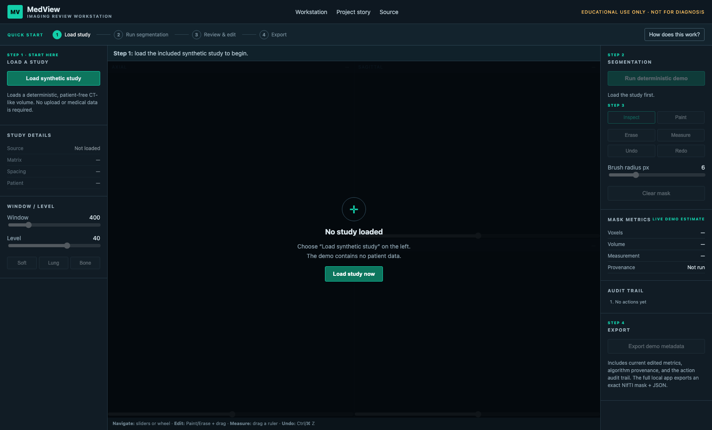
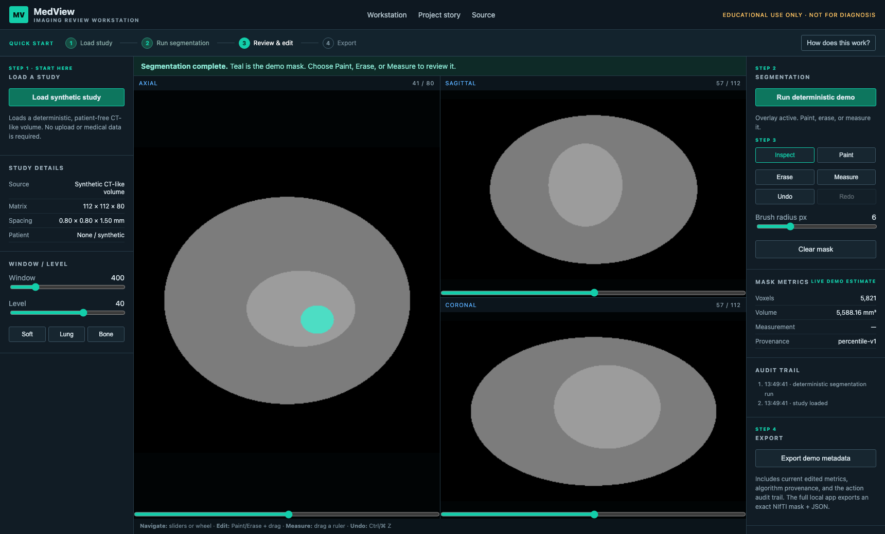
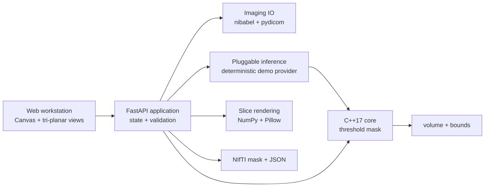

# MedView

**Medical imaging software engineering portfolio — C++/Python, DICOM/NIfTI, interactive review, segmentation editing, measurements, and V&V.**

MedView is a browser-based imaging workstation for loading a 3D study, reviewing axial/sagittal/coronal planes, adjusting window/level, overlaying and correcting a demo segmentation, taking a distance measurement, and exporting a NIfTI mask plus traceability metadata. It is designed to demonstrate engineering patterns relevant to medical devices, imaging AI, and surgical robotics—not to train a large model.

**Public interactive demo:** [medview-imaging-workstation.demianman.chatgpt.site](https://medview-imaging-workstation.demianman.chatgpt.site)





> **Educational/portfolio software only. Not a medical device. Not clinically validated and not for diagnosis or treatment.** The included study is deterministic synthetic data and contains no patient or employer data.

## Why I built it

My earlier medical-imaging work was organized as independent projects: each project explored a dataset, algorithm, or imaging problem, and then ended as its own proof of concept. Those projects were useful learning artifacts, but their results were not combined into a reusable workflow that could help the next person understand, inspect, correct, and export an imaging result.

MedView is the deliberate next step. Instead of another isolated model experiment, it focuses on the software around imaging AI: validated inputs, spatial metadata, tri-planar review, deterministic and pluggable inference, human correction, physical measurements, traceable export, and verification. The public website gives students, engineers, and reviewers a zero-install way to understand that workflow. The full repository remains the source of truth for the Python/C++ implementation.

The hosted demo runs entirely in the browser using synthetic data. It demonstrates navigation, window/level, segmentation overlay, paint/erase correction, live estimated metrics, undo/redo (including keyboard shortcuts), measurements, and metadata export with algorithm provenance and an action trail. DICOM/NIfTI file IO, exact native C++ mask metrics, and NIfTI mask export run in the local application because those capabilities require the full backend and native build.

### Public demo: 60-second workflow

1. Select **Load synthetic study** to create the patient-free sample volume.
2. Browse axial, sagittal, and coronal slices; adjust window/level if desired.
3. Select **Run deterministic demo** to add the teal segmentation overlay.
4. Choose **Paint**, **Erase**, or **Measure**, then drag directly on a view; use **Undo/Redo** to review corrections.
5. Select **Export demo metadata** to download the provenance and action record.

The interface keeps later controls disabled until their prerequisite step is complete and shows the next action in the Quick Start bar.

## What works

- Validated 3D NIfTI (`.nii`, `.nii.gz`) and multi-file DICOM series loading, with dimensional, series, slice-shape, finite-value, and upload-size checks
- Patient-coordinate DICOM reconstruction from orientation/position tags, geometric slice ordering, regular-spacing checks, and an explicit fallback warning when geometry tags are unavailable
- Linked axial, sagittal, and coronal slice viewers with wheel navigation, zoom, pan, orientation labels, and configurable window/level presets
- Teal segmentation overlay, deterministic percentile-based demo inference, brush-based paint/erase correction, and bounded undo/redo history
- Interactive distance ruler and physical mask volume/bounds measurements
- NIfTI label-map + JSON metadata export in a ZIP archive, including algorithm provenance and an in-session audit trail
- Full-app undo/redo buttons and standard keyboard shortcuts (`Ctrl/⌘ Z`, `Shift + Ctrl/⌘ Z`), with state reported through the API
- Explicit empty, loading, invalid-file, and success messages; structured server logs and user-safe errors
- Deterministic synthetic CT-like phantom generator for a zero-sensitive-data demo

## Architecture



The typed Python domain model owns the volume, affine, spacing, provenance, and editable mask. IO, processing, inference, rendering, and API/UI are separate modules. The C++ core exposes a small C ABI and is called through `ctypes`; this boundary keeps ownership explicit, works on Linux/macOS, and can be tested without embedding a Python interpreter.

## Run locally

Requirements: Python 3.11+, a C++17 compiler, and CMake 3.20+.

```bash
python3 -m venv .venv
.venv/bin/pip install -e '.[dev]'
.venv/bin/cmake -S . -B build -DCMAKE_BUILD_TYPE=Release
.venv/bin/cmake --build build
.venv/bin/medview
```

Open <http://127.0.0.1:8000>, choose **Load synthetic study**, and then run the deterministic demo segmentation. The demo file is generated locally on first use; alternatively:

```bash
.venv/bin/python -m medview.demo
```

### Container

```bash
docker build -t medview .
docker run --rm -p 8000:8000 medview
```

The UI is served in a browser, so the container needs no GUI forwarding. Local development is faster for rebuilding the native core; Docker is the reproducible runtime/CI parity option.

## DICOM and NIfTI handling

- NIfTI affine and voxel spacing are preserved in exported masks.
- DICOM slices are restricted to one `SeriesInstanceUID`, checked for consistent rows/columns and orientation, ordered geometrically along the slice normal, checked for regular spacing, and rescaled with slope/intercept.
- When `ImageOrientationPatient`, `ImagePositionPatient`, and `PixelSpacing` are present, MedView builds a patient-coordinate affine. Legacy files without geometry tags use a spacing-only affine and receive an explicit metadata warning.
- Uploads are processed in temporary storage, capped at 256 MB, and not retained by the application.
- The loader accepts only 3D volumes; time series and enhanced/multiframe DICOM are outside MVP scope.

## Testing and V&V approach

Run all verification checks:

```bash
make verify
```

The suite includes:

- C++ unit tests for thresholding, voxel counts, physical volume, bounds, empty/invalid inputs
- Python unit tests for tri-planar transforms, rendering, mask painting/erasing, DICOM geometry reconstruction, history behavior, and validation failures
- An integration test covering synthetic generation → load → native processing → NIfTI/JSON export, provenance/audit serialization, and data equality
- API workflow tests covering empty/invalid states, slice rendering, inference, edit, history-state transitions, undo/redo, and ZIP export
- Ruff linting and strict mypy checks
- GitHub Actions across macOS/Linux and Python 3.11/3.13

This is an engineering verification strategy, not clinical validation. There are no claims about diagnostic accuracy, safety, performance, users, or regulatory approval.

## Decisions and tradeoffs

- **Web UI over Qt/VTK:** reliable cross-platform demo and testable HTTP boundary; it does not yet provide GPU volume rendering or native PACS integration.
- **C ABI over pybind11:** a tiny, inspectable ownership boundary with no compiler-specific Python extension packaging; array contiguity is validated/corrected before calls.
- **Deterministic threshold demo over trained model:** reproducible, fast, explainable, and honest. `SegmentationProvider` is the seam for a separately validated model.
- **In-memory history and audit trail:** makes editing actions reviewable and exportable without implying regulated electronic records. Authentication, multi-user isolation, durable/tamper-evident audit storage, DICOMweb, and long-running job orchestration remain intentionally absent.

## Repository map

```text
cpp/                 C++17 processing core and unit tests
src/medview/io/      DICOM/NIfTI loading and export
src/medview/inference/ pluggable segmentation interface
src/medview/processing/ C++ boundary with safe fallback
src/medview/ui/      slice extraction, rendering, annotation
web/                 professional workstation UI
tests/               Python unit, API, and integration tests
.github/workflows/   Linux/macOS CI matrix
```

## Future work

Oblique and enhanced/multiframe DICOM support; connected-component editing; GPU rendering; DICOM SEG/SR export; DICOMweb/PACS integration; durable/tamper-evident audit storage; richer model cards; and formal hazard-linked requirements. Any clinical use would additionally require a quality system, risk management, cybersecurity work, usability engineering, and appropriately designed verification and validation.

## License

MIT. Synthetic generator output is created entirely from mathematical primitives and seeded noise.
